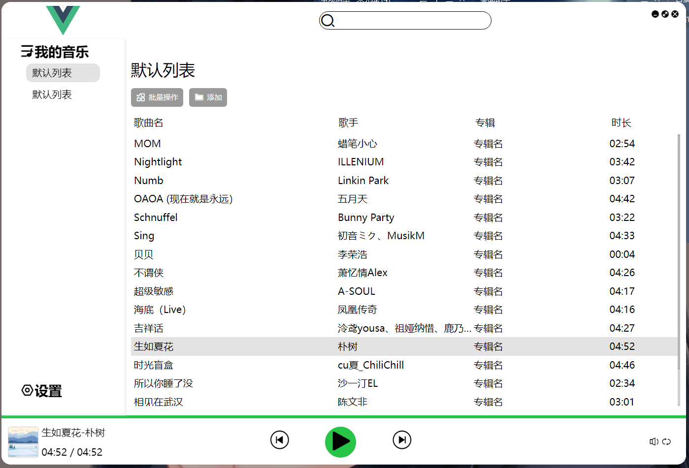
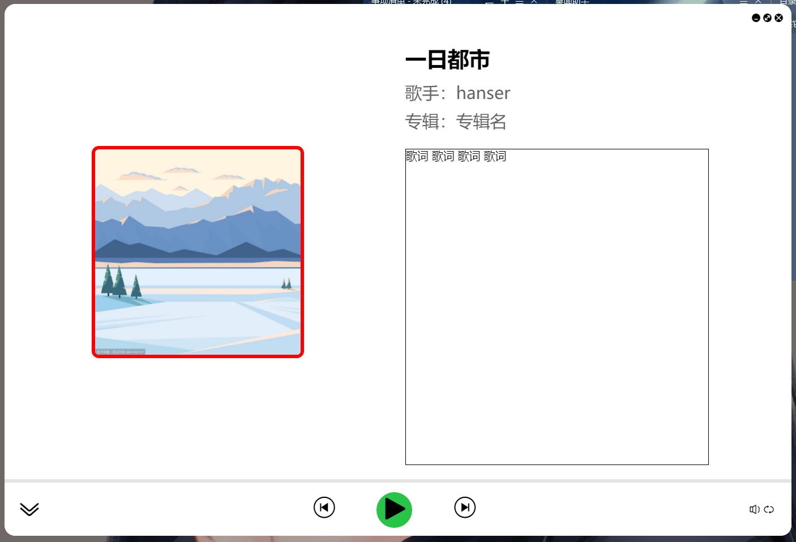

# Local Music Player

## 说明

如果要打开控制台，`controller/musicDataStore.js` 文件中注释掉 `const load = require('audio-loader')` 这一句才可以打开

## 开发任务列表

- [x] 添加音乐
- [ ] 添加音乐等待时添加提示
- [x] 获取音乐时长
- [x] 正确渲染时长
- [x] 鼠标移入移出时显示 `播放` 和 `删除` 按钮
- [x] 点击歌曲列表中 `播放` 按钮，进行播放
- [x] 点击歌曲列表中 `删除` 按钮，进行删除
- [x] 列表循环播放
- [x] 第一次点击底部按钮 `播放` ，播放第一首歌
- [x] 点击底部 `播放` 与 `暂停`，图标也进行切换
- [x] 点击底部 `上一曲` 和 `下一曲`
- [x] 歌曲进度条，
- [x] 歌曲进度条点击、拖拽进行进度切换-----（拖拽没有实现，点击有 bug）
- [ ] 动画效果
- [x] 歌词显示及歌词滚动------(滚动不美观，还有些许bug)
- [x] 获取专辑名称及图片
- [ ] 设置页面及相应功能
- [ ] 我的音乐中列表自定义添加
- [ ] 批量操作（目前只有删除）
- [x] 音量调节
- [ ] 播放模式切换
- [ ] 搜索功能
- [ ] 音乐进度缓存
- [ ] 详情页和主页状态不统一

## api

kg 音乐 api

**搜索歌曲**
1 提供 hash，部分有 album*id
http://mobilecdn.kugou.com/api/v3/search/song?format=json&keyword=关键字&page=1&pagesize=20&showtype=1
2 提供 hash，部分有 AlbumID ---采用
https://songsearch.kugou.com/song_search_v2?keyword=关键字&page=1&pagesize=30
3 提供 hash 和 EMixSongID(encode_album_audio_id)
https://complexsearch.kugou.com/v2/search/song?callback=callback123&srcappid=2919&clientver=1000&clienttime=1676528068513&mid=c873a389849646fbfa13f2a37e33ed7a&uuid=c873a389849646fbfa13f2a37e33ed7a&dfid=0R8DjY2N76ry107YTH4GPprM&keyword=关键字&page=1&pagesize=30&bitrate=0&isfuzzy=0&inputtype=0&platform=WebFilter&userid=0&iscorrection=1&privilege_filter=0&filter=10&token=&appid=1014&signature=d819ab45a7c78bd4b3272d8af0afcb8b
**获取歌曲信息（不带歌词）**
1 提供 album_id
https://m.kugou.com/app/i/getSongInfo.php?cmd=playInfo&hash=106EC000715C5C62AAE36B347B296642
**获取歌词**
1 需要 encode_album_audio_id
https://wwwapi.kugou.com/yy/index.php?r=play/getdata&callback=jQuery19108355710141456396_1676515903626&dfid=0R8DjY2N76ry107YTH4GPprM&appid=1014&mid=c873a389849646fbfa13f2a37e33ed7a&platid=4&encode_album_audio_id=nyfx390&*=1676515903627
2 需要 hash 和 album_id ---采用
https://wwwapi.kugou.com/yy/index.php?r=play/getdata&callback=jQuery19108001866002482712_1600062977462&hash=795fa204c637889bb3bfcafc044d6154&album_id=0&dfid=2lP8Vp1RHLHj0wmucn0XlXFL&mid=c873a389849646fbfa13f2a37e33ed7a
